 # 방 랑  

**어디에도 없던 탐험형 지도 서비스 **

**바로가기 : https://k9b109.p.ssafy.io (웹 소개 페이지)**    

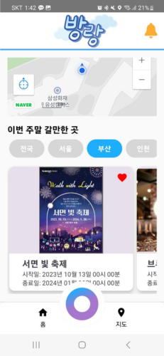

### ⬇️⬇️ 방랑 소개 ⬇️⬇️

**목표 : 기존에 밝혀진 지도로 목적지로 나아가는 지도의 패러다임에서 벗어난
				 미지의 지역을 탐험해 나가며 지도를 밝혀가는 탐험형 지도 서비스를 제공**

1. 기본 기능

 - 유저의 현재 위치를 확인 할 수 있으면서, 현재 위치에서 30km 반경에서 개최중인 축제
	 정보를 얻을 수 있습니다. 또한, 현재 진행중인 다른 지역의 축제 정보를 제공합니다.

2. 방랑 지도

 - 유저가 가보지 못 한 지역은 어둡게 표시되는, 이동함에 따라 지도를 밝혀 나갈 수 있는 지도
	 지도 시스템입니다. 위 지도에서는 가장 가까운 지역 축제와의 거리, 그리고 해당 축제에
   근접하면 축제 정보를 얻을 수 있습니다.

3. 방랑 도장

 - 등록된 지역축제에 반경 500m 내외로 접근하면 해당 축제 정보를 포함하고 있는 도장을 
	 찍을 수 있고, 해당 내용을 나의 컬렉션에서 볼 수 있는 기능입니다.

4. 방랑도

 - 유저가 움직여서 지도를 밝힌 구역의 넓이를 공간 관련 라이브러리인 JTS를 사용해서 계산,
	 유저가 움직인 구역 / (전체 지도 or 특정 지역)* 100 % 를 계산한 값.
	 다른말로, 얼마나 유저가 많이 돌아다녔나를 나타내는 척도.
	 방랑도를 통해, 전국에서 가장 많이 돌아다닌 유저 혹은 각 지역별로 가장 많이 돌아다닌
	 유저를 랭킹 시스템을 통해 확인을 할 수 있습니다.
 

###  ⚙️프로그램 메인 시퀀스⚙️
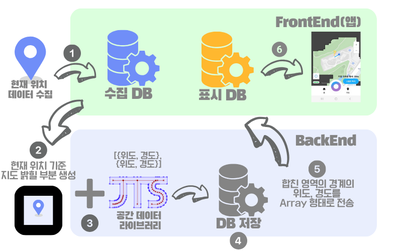
 
 
 
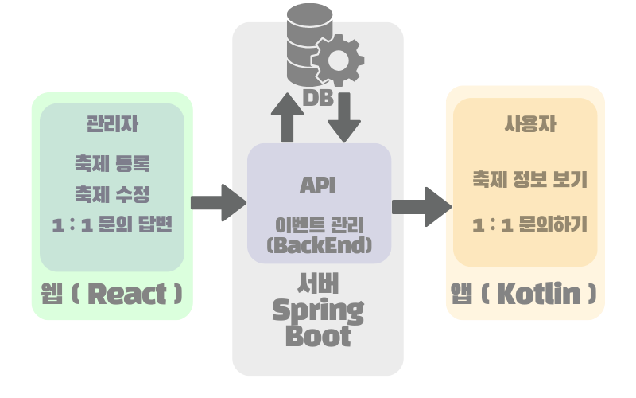

## 📅프로젝트 기간

**23.10.09 ~ 23.11.17 (6주간)**

## 🧝‍♂️팀원 및 역할

| **팀장** | 이성민 (Infra,BE,FE_Web)   |
|----------|---------------------|
| **팀원** | 최미은 (BE, Design) |
|          | 이도형 (FE_Web, Design) |
|          | 김동우 (BE,FE_Web) |
|          | 박해종 (FE_App) |

## 👨‍👩‍👧협업 툴

- GitLab
- Jira
- Notion
- Mattermost
- Webex

## 🛠️주요 기능

1. 접속

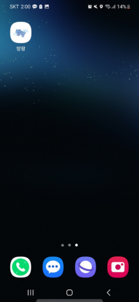
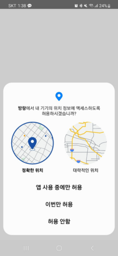

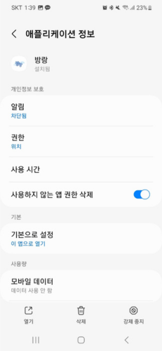

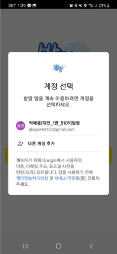
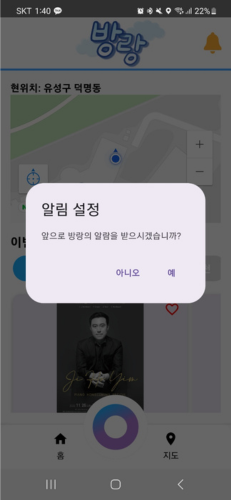
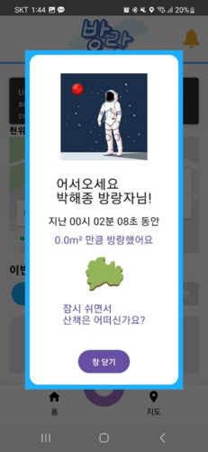

 

2. 메인화면

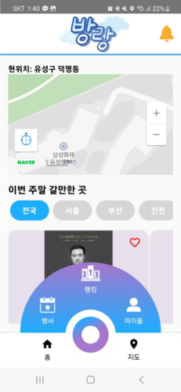
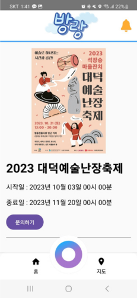
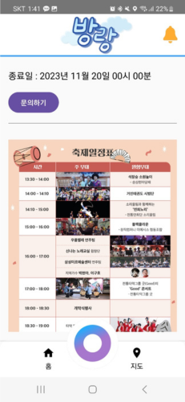
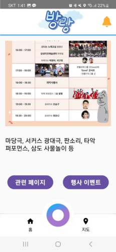
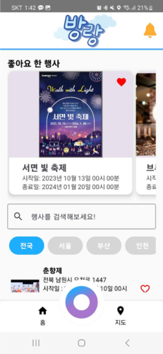

 

3. 방랑 지도

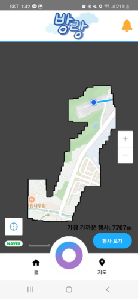
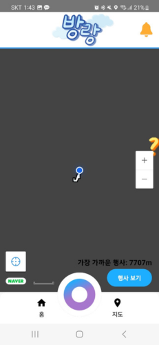
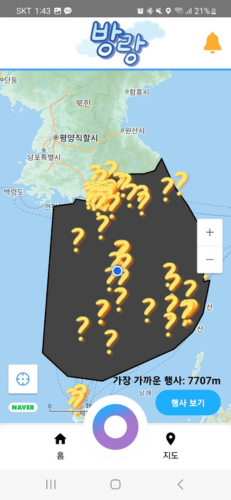
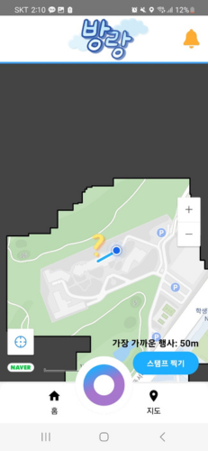
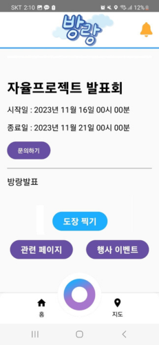
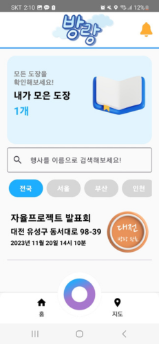

 

4. 랭킹

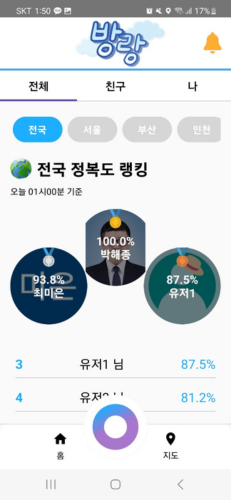
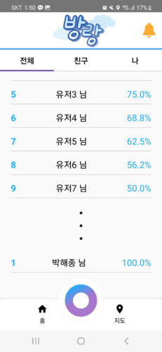
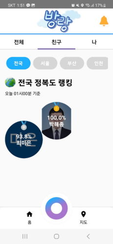
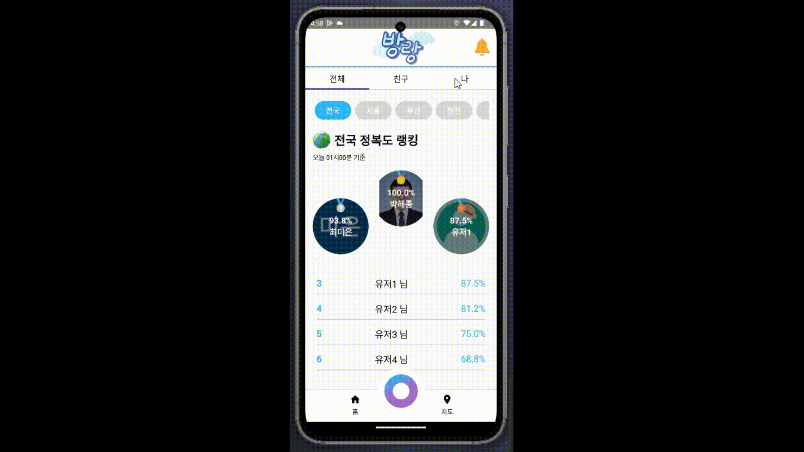

 

5. 부가 기능

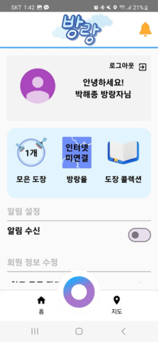
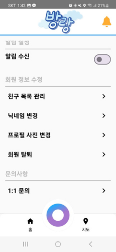
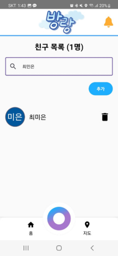
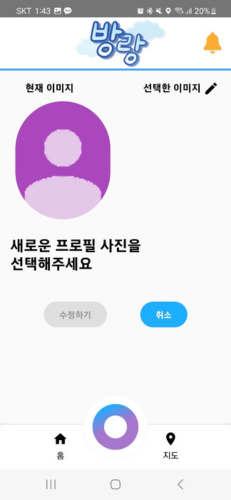
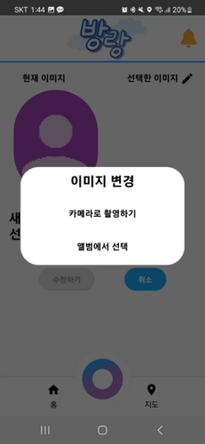
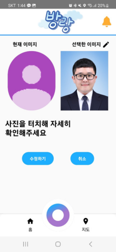
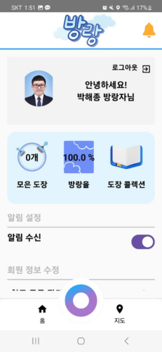
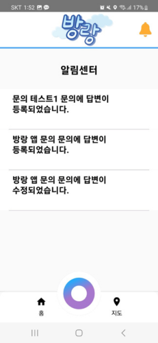
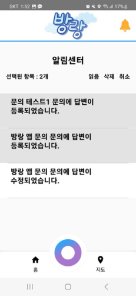
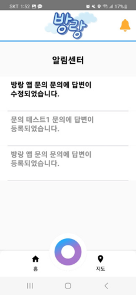
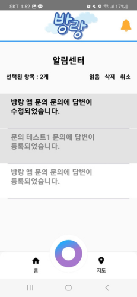

 

## 🖥️ 개발 환경

🖱**Backend**

- IntelliJ
- spring boot 3.1.4
- spring-boot-jpa
- Spring Security
- Java 17
- postgreSQL 42.6.0
- Redis
- firebase 9.2.0

🖱**Frontend_Web**

- Visual Studio Code
- React.js 18.2.0
- node.js 18.16.1
- typescript 4.9.5
- axios 1.6.0
- formik 2.4.5
- styled-components 6.1.1
- react-naver-maps : 0.1.3
- react daum-postcode : 3.1.3
- react-icons : 4.11.0
- react-router-dom : 6.18.0
- react-spring : 9.7.3
- mui material : 5.14.17

🖱**Frontend_Moblie**
- Android Studio
- Kotlin 1.8.10
- Compose(bom:23.03 / 1.4~)
- Retrofit2 2.9.0 
- Hilt 2.44 , hilt compose 1.0.0
- Coroutine 1.7.1
- Coil 2.4.0
- Room
- Google service location 16.0.0
- Naver Map 1.4.0 => https://github.com/fornewid/naver-map-compose
- FMC 32.3.1

🖱**CI/CD**

- AWS EC2
- docker
- docker-compose
- nginx
- jenkins
- PgAdmin4

## 🔧 서비스 아키텍쳐

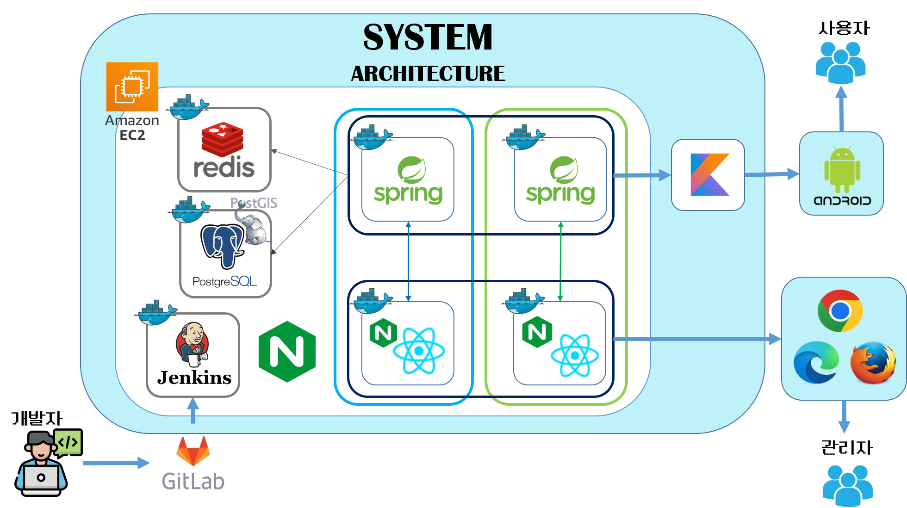

## 📑 API 명세서

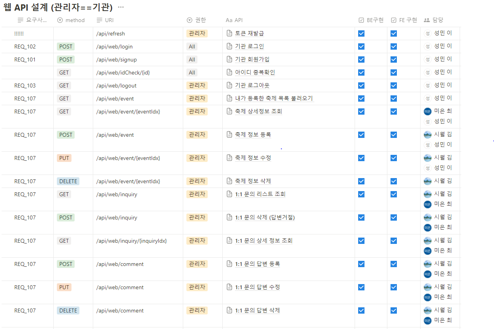
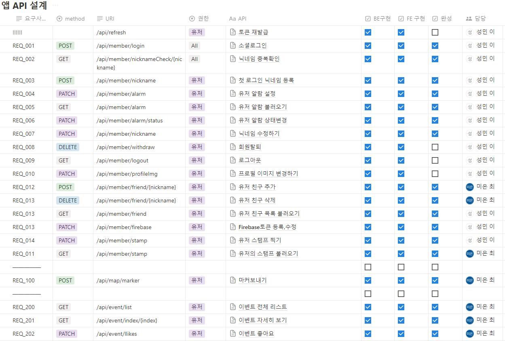

**바로가기 :**
https://www.notion.so/API-4d4cb48404974a1cbf8c855438c90e29?pvs=4
  

## ✨ERD

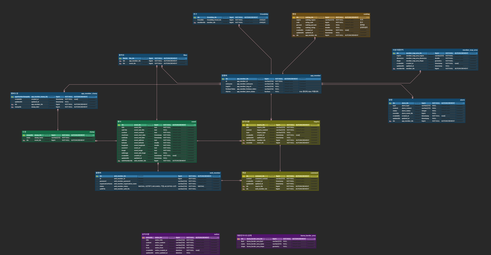

## 📚 커밋 컨벤션 규칙

| Type 키워드 | 사용 시점 |
| --- | --- |
| 첫 커밋 | CREATE: start project |
| Feat | 새로운 기능 추가 |
| Remove | 파일 삭제 |
| Feat | 새로운 기능 추가, 기존의 기능을 요구 사항에 맞추어 수정 |
| Fix | 기능에 대한 버그 수정 |
| Build | 빌드 관련 수정 |
| Chore | (코드의 수정 없이) 설정을 변경 |
| Ci | CI 관련 설정 수정 |
| Docs | 문서(주석) 수정 |
| Style | 코드 스타일, 포맷팅에 대한 수정 |
| Design | CSS 등 사용자 UI 디자인 변경 |
| Resource | 이미지 리소스, prefab 등의 코드와 상관없는 리소스 추가 |
| Refactor | 기능의 변화가 아닌 코드 리팩터링 ex) 변수 이름 변경 |
| Test | 테스트 코드 추가/수정 |
| Release | 버전 릴리즈 |
| Rename | 단순 변수명 or 파일명 바꾼 경우 |
| Readme | README |
| Comment | 필요한 주석 추가 및 변경 |
 ***commit message***
  - commit은 최대한 자세히

`키워드(대문자) :  (영어로 위치/함수/기능) + 설명`

## 🌐EC2 PORT

| 서비스              | 포트  |
|---------------------|-------|
| Spring Boot (BE)    | 8081,8082  |
| React (FE)          | 3001,3002  |
| PostgreSql          | 5432  |
| PgAdmin4            | 5555  |
| redis (DB)          | 6379  |
| Jenkins             | 9090  |

